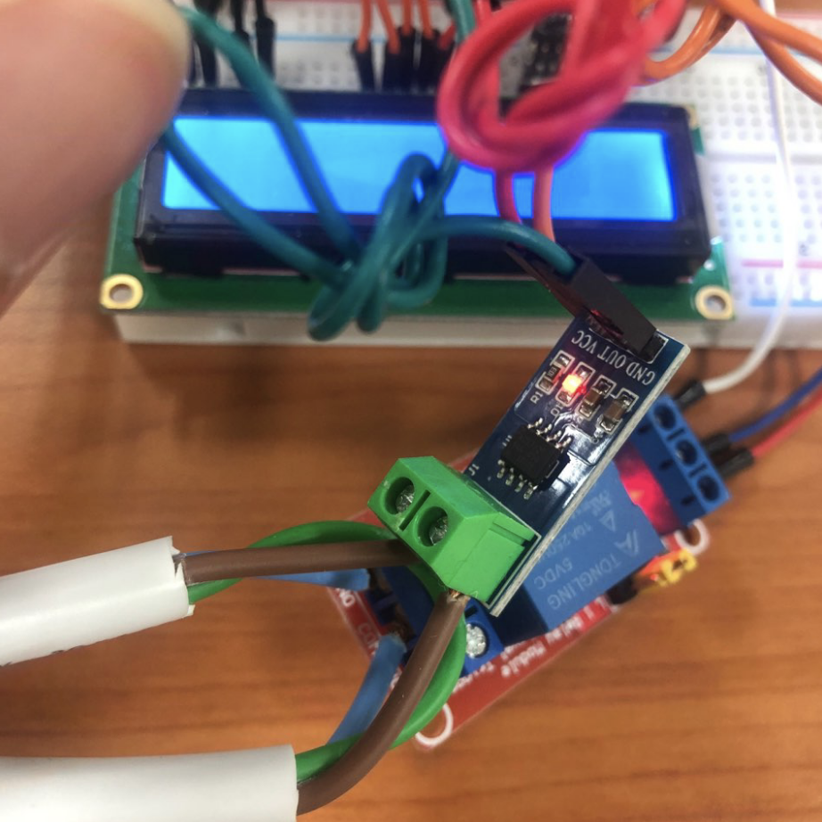

# SMART PLUG 
<br>

# [ ` 👉 Demo ` ](https://drive.google.com/file/d/12r7HJeJhrjO5mxbx8t_fU2SEgAonm5Fd/view?usp=sharing)
<br>
<br>

### PREVIEW


<br>
<br>
<br>
<br>


# HARDWARE
<br>
<br>

### MODULES
|  |  |
| :----: | :----: |
| `arduino` | arduino Uno |
| `shield` | arduino shield | 
| `bluetooth` | HM-10 | 
| `relay` | lv.1 Relay |
| `current sensor` | acs712 | 
| `socket` |250v 10a 2 outlet power strip|
| `LCD` | LCD 1602 |


<br>

### CIRCUIT
<br>


<br><br>
<br>


# DETAIL

## OUTLET


<br><br>


## RELAY

<br><br>

### `Arduino source code`


``` c
#define relay 2
 
void setuo(){
  pinMode (relay, OUTPUT); 
}
void loop(){
    digitalWrite (relay, HIGH);
    digitalWrite (relay, LOW);
}
```


## VOTAGE/CURRENT

<br><br>

### `Arduino source code`


``` c
#define CURRENT 20
char incomingByte;
 
void setuo(){
   
}
void loop(){
 float volt = analogRead(A0) * (5.0 / 1024);
  float current = abs((volt - 2.5) * (CURRENT / 2));
}
```

## BLUETOOTH

<br><br>

### `Arduino source code`


``` c
#include <SoftwareSerial.h>
SoftwareSerial HM10(12 ,13);
 
void setuo(){
    HM10.begin(9600);
}
void loop(){
    HM10.print();
    HM10.read();
}
```


## LCD

<br><br>

### `Arduino source code`

``` c
LiquidCrystal lcd(5, 6, 7, 8, 9, 11);
 
void setuo(){
    lcd.begin(16, 2);
}
void loop(){
 lcd.setCursor(1,0); 
  lcd.print(volt);
lcd.clear();
}
```
